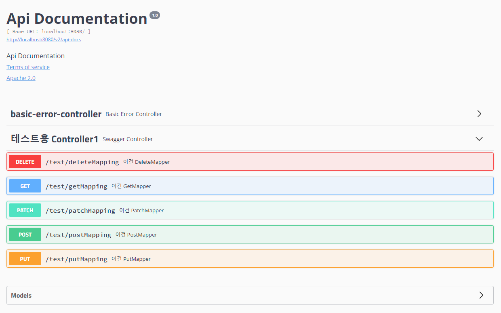
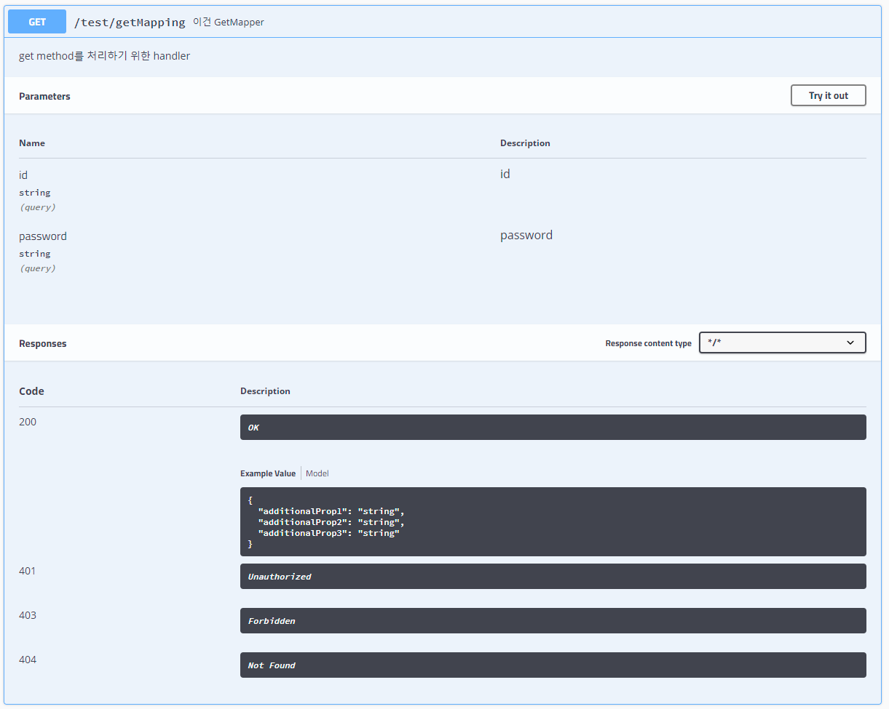

# Swagger-UI-Example

Rest Api Doc 제작을 위한 springgox-Swagger-UI 이용

* 따로 Rest API에 대한 스펙을 명시하지 않고도 Api Doc을 작성할 수 있도록 도와주는 API 

###테스트 환경
* java 8
* Spring MVC
* Spring Boot

###Swagger 의존성 추가
```text
compile group: 'io.springfox', name: 'springfox-swagger-ui', version: '2.9.2'
compile group: 'io.springfox', name: 'springfox-swagger2', version: '2.9.2'
```

###Swagger Bean 생성
```java
@Configuration
@EnableSwagger2     //Swagger2를 활성화하기 위한 Annotation
public class SwaggerConfig {
    @Bean
    public Docket swaggerDocket() {
        return new Docket(DocumentationType.SWAGGER_2)
                .select()                                   //Builder를 통해서 Swagger에 대한 설정을 진행
                .apis(RequestHandlerSelectors.any())        //어떤 package 내의 Controller들을 이용할지 지정, any는 전체
                .paths(PathSelectors.any())                 //특정 uri를 지정(ant Matcher나 regex)하여 이요할지 지정, any는 동일
                .build();
    }
}
```

- 빈을 여러개 지정하고 Docket에 group 이름을 지정해 주는경우 지정해주는 packge나 path에 따라서 묶어줄 수 있음.
- 페이지 오른쪽 위 셀렉트 박스에서 선택 가능

```java
@Configuration
@EnableSwagger2
public class SwaggerConfig {
    @Bean
    public Docket api() {
        return new Docket(DocumentationType.SWAGGER_2)
                .groupName("V1")
                .select()
                .apis(RequestHandlerSelectors.basePackage("com.kihyeonkim.controller"))
                .paths(PathSelectors.any())
                .build();
    }

    @Bean
    public Docket api2() {
        return new Docket(DocumentationType.SWAGGER_2)
                .groupName("V2")
                .select()
                .apis(RequestHandlerSelectors.basePackage("com.kihyeonkim.controller2"))
                .paths(PathSelectors.any())
                .build();
    }
}
```


###Controller에  Swagger 사용을 명시하는 방법
```java
package com.kihyeonkim.swagger.controller;

import io.swagger.annotations.Api;
import io.swagger.annotations.ApiOperation;
import org.springframework.web.bind.annotation.*;

import java.nio.charset.StandardCharsets;
import java.util.*;

/**
 * IDE : IntelliJ IDEA
 * Created by kiheyunkim@gmail.com on 2021-02-04
 * Github : http://github.com/kiheyunkim
 * Comment : 테스트용 Controller 첫 번쨰
 */
@RestController
@RequestMapping("/test")
@Api(tags = {"테스트용 Controller1"})
public class SwaggerController {
    @GetMapping("/getMapping")
    @ApiOperation(value = "이건 GetMapper", notes = "get method를 처리하기 위한 handler")
    public Map<String, String> handleGetMapping(String id, String password) {
        Map<String, String> response = new HashMap<>();
        response.put("id", id);
        response.put("password", password);
        response.put("randomName", Base64.getEncoder().encodeToString(String.valueOf(Math.random() * 13 * 13).getBytes(StandardCharsets.UTF_8)));

        return response;
    }

    @PostMapping("/postMapping")
    @ApiOperation(value = "이건 PostMapper", notes = "post method를 처리하기 위한 handler")
    public String handlePostMapping(String string1, String string2, String string3) {

        return string1 + "+" + string2 + "+" + string3;
    }

    @DeleteMapping("/deleteMapping")
    @ApiOperation(value = "이건 DeleteMapper", notes = "delete method를 처리하기 위한 handler")
    public Map<String, Object> handleDeleteMapping(String param1, String param2) {
        return Collections.singletonMap(param1, Collections.singletonMap("key", param2));
    }

    @PutMapping("/putMapping")
    @ApiOperation(value = "이건 PutMapper", notes = "put method를 처리하기 위한 handler")
    public void handlePutMapping(String name, String phone, int age) {
    }

    @PatchMapping("/patchMapping")
    @ApiOperation(value = "이건 PatchMapper", notes = "patch method를 처리하기 위한 handler")
    public int handlePatchMapping(String name) {

        return (int) (Math.random() * 1000000);
    }
}

```

### 실행 화면(localhost:8080/swagger-ui.html)



### Annotation 종류와 속성
- @api: 명세를 만들 class를 지정
    - tag: class단위로 tag를 지정
- @apiOperation: 명세를 만들 method를 지정
    - value: 각 매소드에 대한 이름 지정
    - note: 해당 메소드에 대한 설명을 지정

### 기타
- 현재는 class에 tag를 지정했기 때문에 class단위로 묶여 있음
- method에 각각의 tag를 지정한다면 그 tag끼리도 묶여서 나오게됨
- class와 method의 tag가 다르면 한쪽만 나오는게 아니라 두 곳에서 모두 나옴
- api에 tag 속성을 정해주지 않으면 class이름을 이용해서 이름으로 사용


### JavaDoc
[swagger Doc](https://swagger.io/docs/specification/2-0/basic-structure/)


